# Stage Flow AI Fullstack Architecture Document

## 1. Introduction
This document outlines the complete fullstack architecture for **Stage Flow AI**, including backend systems, frontend implementation, and their integration. It serves as the single source of truth for AI-driven development, ensuring consistency across the entire technology stack.

### Starter Template or Existing Project
**Status:** Greenfield implementation (transitioning from n8n prototype).
**Starter Strategy:** Custom **Turborepo** setup to manage:
- `apps/web`: Next.js frontend
- `apps/api`: FastAPI backend
- `packages/shared`: Shared TypeScript types (generated from Pydantic) and configs.

This structure supports the "Modular Monolith" requirement and facilitates rapid iteration on both the UI and the AI logic simultaneously.

### Change Log
| Date | Version | Description | Author |
| :--- | :--- | :--- | :--- |
| 2026-01-10 | 1.0 | Initial Unified Architecture (YOLO Mode) | Winston (Architect) |

---

## 2. High Level Architecture

### Technical Summary
Stage Flow AI adopts a modern **Headless Architecture**. The frontend is a **Next.js** application deployed on the Edge, focusing on a rich, interactive "Gamified" user experience. The backend is a robust **FastAPI** service that encapsulates the "Socratic Engine," managing stateful AI conversations and structured data extraction. Data persistence is handled by **PostgreSQL** (enhanced with **pgvector** for RAG), and Authentication is managed via **Supabase**. The system prioritizes low-latency chat interactions via Server-Sent Events (SSE) and strict separation of concerns between presentation (Next.js) and business logic (Python).

### Platform and Infrastructure Choice
**Platform:** **Vercel** (Frontend) + **Render** (Backend) + **Supabase** (Database & Auth).
*   **Key Services:**
    *   **Vercel:** Hosting for Next.js, Edge Functions.
    *   **Render:** Hosting for Python FastAPI (Dockerized), simple scaling, health checks.
    *   **Supabase:** Managed PostgreSQL, Vector Storage, Authentication, and Storage (for PDF artifacts).
*   **Deployment Host and Regions:** `fra1` (Frankfurt) or closest available to target users (France/Europe implied by context).

**Rationale:** This combination offers the best "Zero DevOps" experience. Vercel is the native home for Next.js. Render provides a much simpler PaaS experience for Python/Docker than AWS, ideal for an MVP. Supabase unifies DB and Auth, drastically reducing setup time.

### Repository Structure
**Structure:** Monorepo (Turborepo)
**Package Organization:**
- `apps/web`: Next.js 14+ (App Router)
- `apps/api`: Python FastAPI
- `packages/types`: Shared interfaces (TypeScript)
- `packages/config`: ESLint, Prettier, TSConfig

### Architectural Patterns
- **BFF (Backend for Frontend):** The FastAPI backend serves specifically the needs of the Stage Flow web client, aggregating data and formatting it for UI consumption. _Rationale:_ Simplifies the frontend logic, keeping the "heavy lifting" (AI, DB) in Python.
- **Event-Driven UI Updates:** The "Skill Inventory" updates reactively based on chat events. _Rationale:_ Provides the "dopamine reward" feedback loop described in the PRD.
- **RAG (Retrieval-Augmented Generation):** Used for the "Search & Match" and "Company Context" features. _Rationale:_ Allows the AI to ground its cover letter generation in real company data (as seen in the n8n prototype).
- **State Machine (The "Hero's Journey"):** The user's progress is strictly modeled as a state machine (Phase 1 -> Phase 2). _Rationale:_ Enforces the "Gating" logic required by the PRD.

### Architecture Diagram
```mermaid
graph TD
    User[User (Web/Mobile)] -->|HTTPS| CDN[Vercel Edge Network]
    CDN -->|Next.js App| Web[Web App (Next.js)]
    
    subgraph Frontend
        Web --> Auth[Supabase Auth SDK]
        Web -->|REST / SSE| API_GW[FastAPI Backend]
    end
    
    subgraph Backend Services (Render)
        API_GW --> AuthMiddleware[Auth Guard]
        API_GW --> Socratic[Socratic Agent (LangChain)]
        API_GW --> Analyst[Analyst Agent (Gatekeeper)]
        API_GW --> Generator[PDF Generator]
    end
    
    subgraph Data & AI
        Socratic -->|LLM Calls| LLM[OpenAI / Anthropic / Gemini]
        Socratic -->|Context| VectorDB[(Supabase pgvector)]
        Analyst -->|Store Skills| DB[(Supabase PostgreSQL)]
        Generator -->|Store Files| Storage[Supabase Storage]
    end
```

---

## 3. Tech Stack

### Technology Stack Table

| Category | Technology | Version | Purpose | Rationale |
| :--- | :--- | :--- | :--- | :--- |
| **Frontend Language** | TypeScript | 5.x | Type Safety | Standard for robust React development. |
| **Frontend Framework** | Next.js | 14+ (App) | UI & Routing | Leading React framework, great performance, server components. |
| **UI Library** | Shadcn/UI + Tailwind | Latest | Styling | Rapid development, accessible, highly customizable, "beautiful by default". |
| **State Management** | Zustand | Latest | Client State | Simple, lightweight, perfect for "Inventory" management without Redux bloat. |
| **Backend Language** | Python | 3.11+ | Business Logic | Native language of AI/ML (LangChain), robust typing in modern versions. |
| **Backend Framework** | FastAPI | 0.100+ | API | High performance, async native, auto-OpenAPI docs. |
| **API Style** | REST + SSE | - | Communication | REST for CRUD, Server-Sent Events for streaming chat responses. |
| **Database** | PostgreSQL | 15+ | Relational Data | Robust, reliable, relational data integrity. |
| **Vector DB** | pgvector | - | RAG | Integrated directly into Postgres (Supabase), no separate service needed. |
| **Authentication** | Supabase Auth | - | Identity | Handles social login (Google), JWT management securely. |
| **File Storage** | Supabase Storage | - | Artifacts | Store generated PDFs and user uploads. |
| **LLM Orchestration** | LangChain (Python) | Latest | AI Logic | Industry standard for chaining prompts and managing context. |
| **Build Tool** | Turbo | Latest | Monorepo Build | Caching and orchestration for the monorepo. |
| **CI/CD** | GitHub Actions | - | Automation | Standard, free for public/small private repos. |
| **Monitoring** | Sentry | - | Error Tracking | Fullstack error tracking (JS + Python). |

---

## 4. Data Models

### Conceptual Models

#### **User**
**Purpose:** Core identity and profile link.
**Key Attributes:**
- `id`: UUID (PK)
- `email`: String
- `full_name`: String
- `current_phase`: Integer (1-10) - *Tracks progress on the "Map"*

#### **JourneySession**
**Purpose:** Represents the state of the introspection journey.
**Key Attributes:**
- `user_id`: UUID (FK)
- `phase_id`: Integer
- `messages`: JSONB (List of chat objects)
- `context`: JSONB (Accumulated facts for RAG)
- `is_locked`: Boolean (Gate status)

#### **Skill** (The "Inventory")
**Purpose:** Verified evidence-based skills extracted by the "Analyst".
**Key Attributes:**
- `id`: UUID
- `user_id`: UUID
- `name`: String (e.g., "Conflict Resolution")
- `category`: Enum (Hard/Soft/Tool)
- `evidence`: String (The "STAR" story)
- `confidence_score`: Float

#### **Company**
**Purpose:** Target entity for applications.
**Key Attributes:**
- `id`: UUID
- `name`: String
- `domain`: String
- `location`: String
- `meta_data`: JSONB (Enriched data from Perplexity/Search)

### Shared TypeScript Interface (Example)

```typescript
export interface UserProfile {
  id: string;
  email: string;
  fullName: string;
  currentPhase: number;
}

export interface Skill {
  id: string;
  name: string;
  category: 'HARD' | 'SOFT' | 'TOOL';
  evidence: string;
}

export interface ChatMessage {
  role: 'user' | 'assistant' | 'system';
  content: string;
  timestamp: string;
}
```

---

## 5. API Specification

### REST API (FastAPI)

**OpenAPI 3.0 Structure:**

```yaml
openapi: 3.0.0
info:
  title: Stage Flow AI API
  version: 1.0.0
servers:
  - url: /api/v1
paths:
  /chat/message:
    post:
      summary: Send a message to the Socratic Agent
      description: Returns a streaming response (SSE)
      requestBody:
        content:
          application/json:
            schema:
              type: object
              properties:
                message: {type: string}
                phase_id: {type: integer}
  /journey/state:
    get:
      summary: Get current map progress and locked status
  /skills:
    get:
      summary: Fetch the user's skill inventory
    post:
      summary: Manually add a skill (optional override)
  /search/companies:
    get:
      summary: Search for companies by domain/location
  /application/generate:
    post:
      summary: Generate PDF/Markdown for a specific company
```

---

## 6. Components

### Component List

#### **SocraticEngine (Backend)**
**Responsibility:** Manages the LLM conversation loop. Loads phase-specific prompts (from "Hidden Menus"), maintains context window, and streams responses.
**Key Interfaces:** `generate_response(history, phase)`, `stream_token()`.
**Dependencies:** LangChain, OpenAI API.

#### **AnalystAgent (Backend)**
**Responsibility:** The "Gatekeeper". Runs in the background (or post-message) to analyze user input against the "DoD" (Definition of Done) for the current phase. Extracts skills if criteria are met.
**Key Interfaces:** `analyze_message(msg)`, `extract_skills(text)`, `check_gate(criteria)`.
**Dependencies:** LangChain, Database (Write access).

#### **MetroMap (Frontend)**
**Responsibility:** Visualization of the 10-step journey. Handles navigation between unlocked phases and displays status (Locked/In-Progress/Done).
**Key Interfaces:** `onPhaseSelect`, `currentPhase`, `unlockedPhases`.
**Tech Stack:** React, SVG/Canvas (or a library like React Flow if complex).

#### **SkillInventory (Frontend)**
**Responsibility:** Sidebar component displaying extracted skills. Animates when new items are added (The "flying" animation).
**Key Interfaces:** `skills` prop, `onSkillClick` (to edit/view details).
**Tech Stack:** React, Framer Motion (for animations).

### Component Diagram (C4 Container)

```mermaid
graph TB
    Client[Web Client]
    
    subgraph "Next.js App"
        Map[Metro Map UI]
        Chat[Chat Interface]
        Inv[Skill Inventory]
    end
    
    subgraph "FastAPI Service"
        Orch[Orchestrator]
        Soc[Socratic Agent]
        Analyst[Analyst/Gatekeeper]
        Gen[Asset Generator]
    end
    
    Client --> Map
    Client --> Chat
    Client --> Inv
    
    Chat -->|Msg| Orch
    Orch -->|Stream| Chat
    Orch -->|Delegates| Soc
    Orch -->|Delegates| Analyst
    Analyst -->|Update| Inv
    
    Gen -->|PDF| Client
```



---

## 7. Core Workflows

### Chat & Skill Extraction Loop


---

## 8. Database Schema (PostgreSQL)

```sql
-- Users
CREATE TABLE users (
    id UUID PRIMARY KEY DEFAULT uuid_generate_v4(),
    email TEXT UNIQUE NOT NULL,
    full_name TEXT,
    created_at TIMESTAMPTZ DEFAULT NOW()
);

-- Introspection Phases (Static Config or Table)
CREATE TABLE phases (
    id SERIAL PRIMARY KEY,
    name TEXT NOT NULL, -- e.g. "The Call to Adventure"
    description TEXT,
    order_index INT UNIQUE
);

-- User Progress
CREATE TABLE user_journey (
    user_id UUID REFERENCES users(id),
    current_phase_id INT REFERENCES phases(id),
    is_locked BOOLEAN DEFAULT TRUE,
    metadata JSONB DEFAULT '{}', -- Store specific answers
    PRIMARY KEY (user_id)
);

-- Chat History
CREATE TABLE chat_messages (
    id UUID PRIMARY KEY DEFAULT uuid_generate_v4(),
    user_id UUID REFERENCES users(id),
    phase_id INT REFERENCES phases(id),
    role TEXT NOT NULL, -- user/assistant
    content TEXT NOT NULL,
    created_at TIMESTAMPTZ DEFAULT NOW()
);

-- Extracted Skills (The Inventory)
CREATE TABLE skills (
    id UUID PRIMARY KEY DEFAULT uuid_generate_v4(),
    user_id UUID REFERENCES users(id),
    name TEXT NOT NULL,
    category TEXT, -- Hard/Soft
    evidence_text TEXT, -- The "STAR" story
    source_message_id UUID REFERENCES chat_messages(id),
    created_at TIMESTAMPTZ DEFAULT NOW()
);
```

---

## 9. Frontend Architecture

### Component Organization
`apps/web/src/components`
- `/layout`: Shell, Sidebar, Navigation
- `/features`:
  - `/map`: Metro Map components
  - `/chat`: Chat bubble, input, typing indicators
  - `/inventory`: Skill cards, list view
  - `/dashboard`: Main dashboard assembly
- `/ui`: Atomic design elements (Buttons, Inputs) from Shadcn

### State Management (Zustand)
```typescript
// store/useJourneyStore.ts
interface JourneyState {
  currentPhase: number;
  skills: Skill[];
  isLocked: boolean;
  addSkill: (skill: Skill) => void;
  unlockPhase: () => void;
}
```

### Frontend Services
Services in `apps/web/src/lib/api` will use a typed `fetch` wrapper to communicate with the FastAPI backend, handling JWT injection automatically via Supabase Auth helpers.

---

## 10. Backend Architecture

### Service Organization (FastAPI)
`apps/api/app`
- `/api`: Routes/Controllers (`/v1/chat`, `/v1/journey`)
- `/core`: Config, Security, Database connection
- `/services`:
  - `llm_service.py`: LangChain logic
  - `gatekeeper_service.py`: Logic for checking phase completion
  - `pdf_service.py`: Generation logic
- `/models`: Pydantic models (DTOs) and SQLModel/SQLAlchemy schemas

### Authentication
Implemented via **Supabase Auth**.
1. Frontend authenticates with Supabase, gets JWT.
2. Frontend sends JWT in `Authorization: Bearer` header to FastAPI.
3. FastAPI validates JWT using Supabase secret key.
4. User identity extracted and injected into request context.

---

## 11. Deployment Architecture

### Strategy
- **Frontend (Vercel):** Git-push deployment. Environment variables configured for API URL and Supabase keys.
- **Backend (Render):** Dockerfile deployment.
    ```dockerfile
    FROM python:3.11-slim
    WORKDIR /app
    COPY requirements.txt .
    RUN pip install -r requirements.txt
    COPY . .
    CMD ["uvicorn", "app.main:app", "--host", "0.0.0.0", "--port", "8000"]
    ```
- **Database:** Managed Supabase instance.

### Environments
| Environment | Frontend URL | Backend URL | Purpose |
| :--- | :--- | :--- | :--- |
| **Development** | `localhost:3000` | `localhost:8000` | Local dev |
| **Production** | `stageflow.ai` | `api.stageflow.ai` | Live |

---

## 12. Security and Performance

### Security Requirements
- **LLM Safety:** System prompts must strictly prevent prompt injection. "Analyst" agent acts as a second layer to verify output quality.
- **Data Privacy:** Introspection data is sensitive. RLS (Row Level Security) policies in Postgres (via Supabase) should be enabled as a defense-in-depth measure, even if the API handles access.

### Performance Optimization
- **Streaming:** ALL chat interactions must stream. Waiting 3-5 seconds for a full block of text breaks flow.
- **Optimistic UI:** When a user unlocks a node, the UI should update immediately, reverting only if the server fails.

---

## 13. Testing Strategy

### Testing Pyramid
- **E2E (Playwright):** Critical flows only (Login -> Complete Phase 1 -> Check Inventory).
- **Backend Unit (Pytest):** Heavy focus here. Test the "Analyst" logic—does it correctly identify a valid STAR answer vs. a vague one? Test Prompt handling.
- **Frontend Unit (Jest/Vitest):** Test complex UI logic (Metro Map navigation, State updates).

---

## 14. Coding Standards (Critical Rules)

- **Type Sharing:** Pydantic models in Python should be synced with TypeScript interfaces (using tools like `datamodel-code-generator` or manual sync in strict `packages/types`).
- **No Direct SQL:** Use an ORM (SQLAlchemy or SQLModel) to prevent injection and maintain maintainability.
- **Environment Variables:** Strictly typed config. Fail startup if keys are missing.
- **Error Handling:** Unified error response structure `{ "error": { "code": "...", "message": "..." } }`.

---
