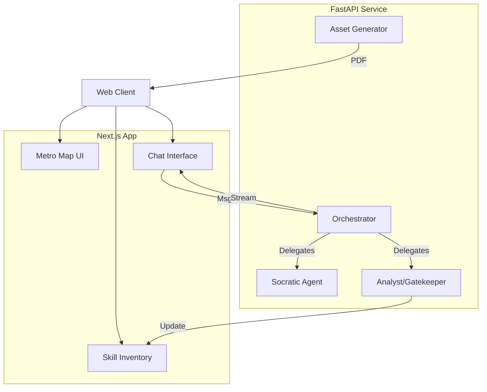

# Components

## Component List

### SocraticEngine (Backend)
**Responsibility:** Manages the LLM conversation loop. Loads phase-specific prompts (from "Hidden Menus"), maintains context window, and streams responses.
**Key Interfaces:** `generate_response(history, phase)`, `stream_token()`.
**Dependencies:** LangChain, OpenAI API.

### AnalystAgent (Backend)
**Responsibility:** The "Gatekeeper". Runs in the background (or post-message) to analyze user input against the "DoD" (Definition of Done) for the current phase. Extracts skills if criteria are met.
**Key Interfaces:** `analyze_message(msg)`, `extract_skills(text)`, `check_gate(criteria)`.
**Dependencies:** LangChain, Database (Write access).

### MetroMap (Frontend)
**Responsibility:** Visualization of the 10-step journey. Handles navigation between unlocked phases and displays status (Locked/In-Progress/Done).
**Key Interfaces:** `onPhaseSelect`, `currentPhase`, `unlockedPhases`.
**Tech Stack:** React, SVG/Canvas (or a library like React Flow if complex).

### SkillInventory (Frontend)
**Responsibility:** Sidebar component displaying extracted skills. Animates when new items are added (The "flying" animation).
**Key Interfaces:** `skills` prop, `onSkillClick` (to edit/view details).
**Tech Stack:** React, Framer Motion (for animations).

## Component Diagram (C4 Container)

