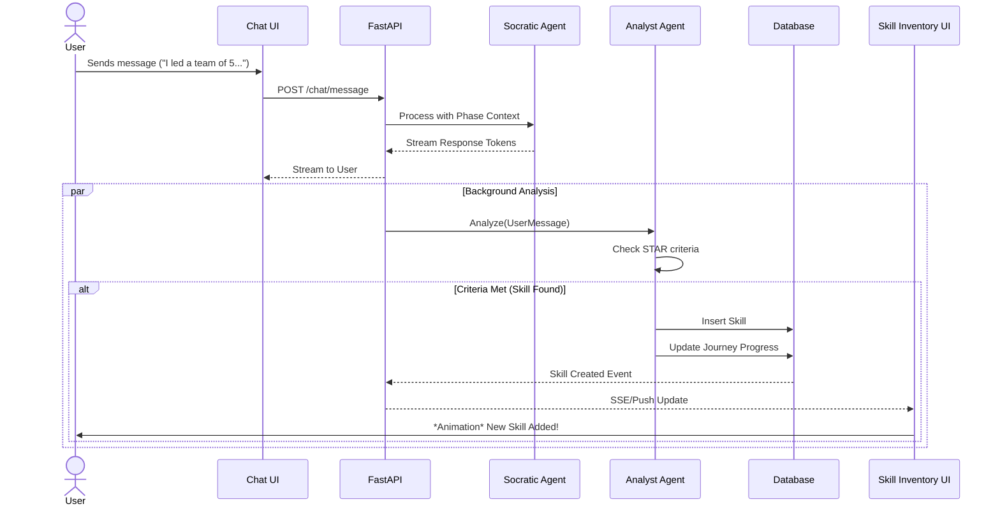

# Core Workflows

## Chat & Skill Extraction Loop

```mermaid
sequenceDiagram
    actor User
    participant UI as Chat UI
    participant API as FastAPI
    participant AI as Socratic Agent
    participant Gate as Analyst Agent
    participant DB as Database
    participant Inv as Skill Inventory UI

    User->>UI: Sends message ("I led a team of 5...")
    UI->>API: POST /chat/message
    API->>AI: Process with Phase Context
    AI-->>API: Stream Response Tokens
    API-->>UI: Stream to User
    
    par Background Analysis
        API->>Gate: Analyze(UserMessage)
        Gate->>Gate: Check STAR criteria
        alt Criteria Met (Skill Found)
            Gate->>DB: Insert Skill
            Gate->>DB: Update Journey Progress
            DB-->>API: Skill Created Event
            API-->>Inv: SSE/Push Update
            Inv->>User: *Animation* New Skill Added!
        end
    end
```
